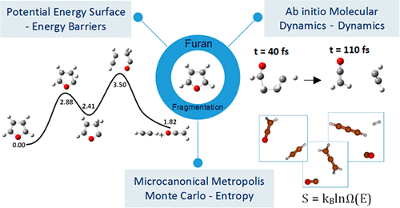
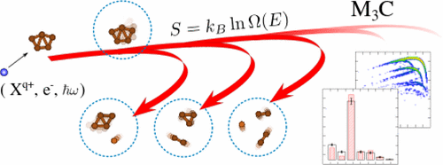
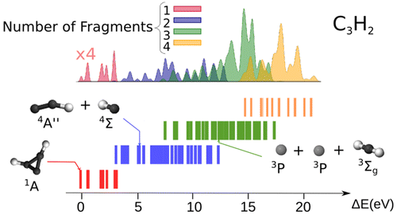

## M3C-store

M3C-store is a ...

## Authors (alphabetical order)
* Nestor F. Aguirre ( nfaguirrec@gmail.com )
* Manuel Alcamí ( xx@xxx )
* Sergio Díaz-Tendero ( xx@xxx )
* Ewa Erdmann ( xx@xxx )
* Paul-Antoine Hervieux ( xx@xxx )
* Marta Łabuda ( xx@xxx )
* Juan P. Sánchez ( xx@xxx )

## Citing

<!--To cite this database, please proceed as follows:

[](https://zenodo.org/badge/latestdoi/33068598)-->

<p align="center">
  
</p>

1. Furan Fragmentation in the Gas Phase: New Insights from Statistical and Molecular Dynamics Calculations.  
E. Erdmann, M. Łabuda, N. F. Aguirre, S. Díaz-Tendero, and M. Alcamí  
[*J. Phys. Chem. A* **122**, 4153-4166 (2018)](http://pubs.acs.org/doi/10.1021/acs.jpca.8b00881)

<p align="center">
  
</p>

2. M3C: A Computational Approach To Describe Statistical Fragmentation of Excited Molecules and Clusters.  
N. F. Aguirre, S. Díaz-Tendero, P.-A. Hervieux, M. Alcamí, and F. Martín.  
[*J. Chem. Theory Comput.* **13**, 992-1009 (2017)](http://pubs.acs.org/doi/pdf/10.1021/acs.jctc.6b00984)

<p align="center">
  
</p>

3. Structure, Ionization, and Fragmentation of Neutral and Positively Charged Hydrogenated Carbon Clusters:  
C<sub>n</sub>H<sub>m</sub><sup>q+</sup> (n=1-5, m=1-4, q=0-3).  
J. P. Sánchez, N. F. Aguirre, S. Díaz-Tendero, F. Martín, and M. Alcamí.  
[*J. Phys. Chem. A* **120**, 588-605 (2016)](http://pubs.acs.org/doi/abs/10.1021/acs.jpca.5b10143)

### Using the database with M3C
Download the .zip file from this page and extract the files,
```
$ unzip M3C-store-master.zip
Archive:  M3C-store-master.zip
012efb01d2b1ffb8b94e856e4cc720d7d5946639
   creating: M3C-store-master/
 extracting: M3C-store-master/README  
   creating: M3C-store-master/develop/
   creating: M3C-store-master/develop/6-311++G.3df.2p/
   creating: M3C-store-master/develop/6-311++G.3df.2p/C4N/
...

$ mv M3C-store-master/ M3C-store
```
or clone the repository using git
```
$ git clone https://github.com/nfaguirrec/M3C-store.git
```
This should be the content of the M3C-store directory if previous steps were successful:
```
$ cd M3C-store
$ ls
develop  images  master  README.md  utils
```
<!--Finally, to use the database in M3C, you simply have to copy the files in a directory included in the PATH system variable, as for example bin in your home directory:
```
$ cp sjobq/* $HOME/bin/
```-->

